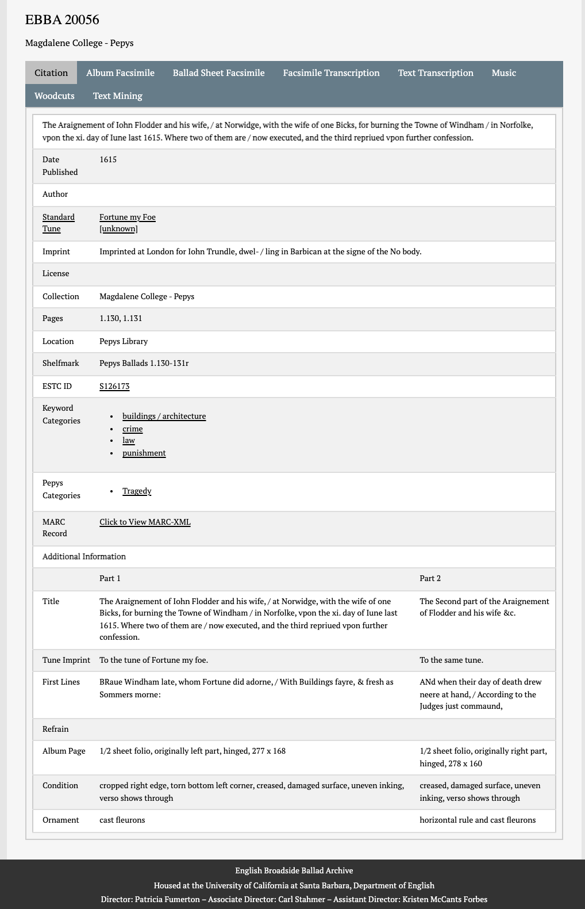

# english-broadside-ballad
Parse data from the English Broadside Ballad Archive [(EBBA)](https://ebba.english.ucsb.edu) to create .tsv (tab delimited) file of ballad metadata

## Summary
As far as I know, there doesn't seem to be metadata on ballads from EBBA in a tabular format. Having information on ballads, e.g. Title, Year etc. in tabular format makes it much more accessible to researchers because they can analyse it in software like MS Excel.

*If all you would like is a .tsv file that can be imported into MS Excel or read by Pandas etc, download the file `EBBA_1500_1800.tsv` This contains metadata for ballads produced between 1500 and 1800 on the EBBA website. To add a .tsv file in MS Excel, open a new workbook, select the 'Data'>'Get Data'>'From Text'. Find the .tsv file on your computer using the prompt that opens up. Choose 'delimited', select 'Tab' as delimiter, select {none} as Text qualifier. On the next step, where you specifiy data formats, the majority should be 'text' because fields that might look numeric like the 'Date Published' actually contain text. These fields will need cleaning to use in analysis etc.*

## EBBA & Ballad Metadata
The EBBA website states that ballad metadata can be accessed via a .xml file download of search results. When looking at the .xml file, I couldn't work out how to differentiate between different tags with the same names, apparently coding different information. Also, there were missing tags - some ballads didn't have their title coded in the .xml but when checking the corresponding 'citation' webpage for the ballad, a title was listed. For this reason, although the .xml file contains more information about the digitisation of the ballad and attributions for that work, I've focused on extracting the information about ballads found on the 'citation' page for each ballad.

We still need the .xml file to get a url for each ballad's citation page, though.

 The homepage states that there are 9575 ballads, but I haven't been able to return this number via the search field. I tried a wild card '*' in the Title and Full Text fields but this searched for the literal '*'. The most results I've been able to return are 9559, achieved by searching ' ' (a space) in the 'Title' field. The xml page didn't load these results, so I've used a smaller subset. I primarily wanted to look at ballads by date, so limited my search to ballads between 1500-1800, which returned 6800 results. By searching on the date field, we're limited to ballads where the date is given (even if imprecise). So, there will be many ballads that were actually produced between 1500 and 1800, but don't show in the results because the date field is either blank or contains '?'.

On the search results page, click '[View Results as MarcXML]'. There's a download link provided, which didn't download the full .xml file for me. I selected all the xml displayed on the webpage and saved it to a .xml file in a text editor. The xml is not all valid, there were some '&' that were not writting out as '&amp;', but finding and replacing these fixed it. You'll also need to remove the first few and last lines of the xml which aren't part of the xml.

The URL for each ballad is found in this part of the xml:

```xml
<datafield tag="856" ind1="4" ind2="0">
	<subfield code="u">http://ebba.english.ucsb.edu/ballad/20001/</subfield>
	<subfield code="z">English Broadside Ballad Archive.</subfield>
```

For each ballad, I parsed this url field into a list of urls, adding the word 'citation' onto the end to produce a url to the citation page. E.g. http://ebba.english.ucsb.edu/ballad/20001/citation

Here's an example of the citation page for a ballad:


I then scraped the data in the table on the citation page. I combined each ballad's citation table into a table of all ballads. I outputting this as a .csv file, which can be opened in MS Excel etc.

This is a sample entry:

ballad\_id|Date Published|Author|Standard Tune|Imprint|License|Collection|Location|Shelfmark|ESTC ID|Keyword Categories|MARC Record|Title|Tune Imprint|First Lines|Refrain|Condition|Ornament|url|Pepys Categories|Album Page|Notes|Pages
:-----:|:-----:|:-----:|:-----:|:-----:|:-----:|:-----:|:-----:|:-----:|:-----:|:-----:|:-----:|:-----:|:-----:|:-----:|:-----:|:-----:|:-----:|:-----:|:-----:|:-----:|:-----:|:-----:
31603|1663-1674| |Sabina|Printed for F. Coles, T. Vere, and J. Wright| |British Library - Roxburghe|British Library|C.20.f.8.93|R228172|love\|mythology / Classical\|sex / sexuality|Click to View MARC-XML|CVPIDS CVRTESIE: / in the wooing of fair Sabina.|To a pleasant new Tune.|AS on a day Sabina fell asleep, / Into her bower it was my chance to creep,|I first spake soft, \| And thought it best, \| Then did I touch, \| But yet she slept, \| Where Cupids lips, \| With quaking fear,| | |http://ebba.english.ucsb.edu/ballad/31603/citation| | |Printed on the verso of EBBA 31602, entitled "WILLOUGHBY: / Being a true Relation of a famous and bloody BATTEL fought in Flanders, / by the Noble and Valiant Willoughby, with 1500 English, against 40000 Spa- / niards, where the English obtain'd a notable Victory, to the Glory and Renown of our Nation."|2.93 Verso

If ballads have more than one part, then the information on each part is separated by a pipe '|' in the relevant field. E.g. `Title` - 'title of first part|title of second part'. I've done the same for fields with mutliple values, e.g. the `Keyword Categories` field.

In scraping, I found that sometimes the pages of the ballad were listed under 'Pages', and sometimes under 'Page'. I've added all those that were listed under the title 'Page' to the column 'Pages', so there's only one column with page numbers.

## EBBA Use Policy

See here for full EBBA Use Policy https://ebba.english.ucsb.edu/page/use-policy. EBBA is open access, licensed under a Creative Commons Attribution-NonCommercial 4.0 International License.
